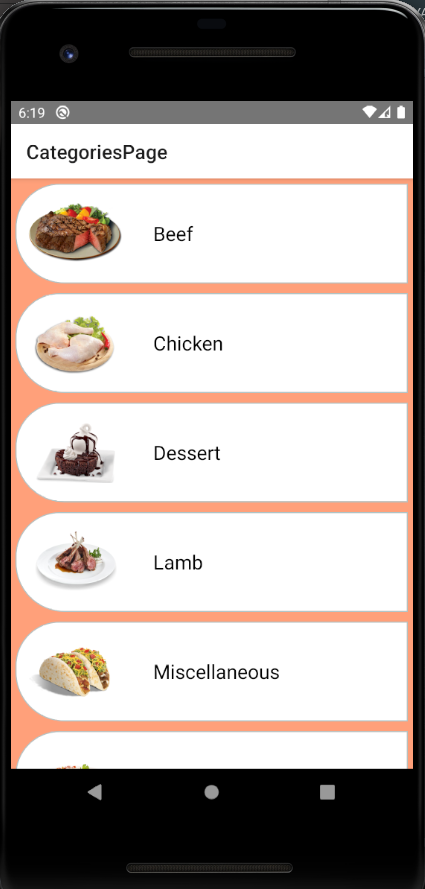

# Tarifka App
 

 
<div>




</div>

 

## Running Project

In this project, I created an App to show information abouts foods

After the project is downloaded, the project is opened with the 'Visual Studio Code' editor.

At the terminal;
```
npm install

```
The packages used in the project with the command line are created in the "node_modules" folder.
```
npx react-native run-android
```
command is run.
```
npx react-native start
```
command is run.

If you see white screen, close App and open it again on emulator.